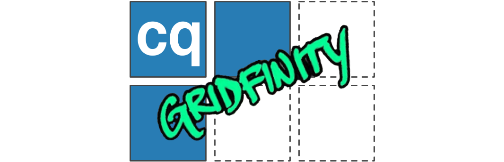

<!--  -->


# cq-gridfinity


<a href="https://github.com/psf/black"></a>


This repository contains a python library to build [Gridfinity](https://gridfinity.xyz) boxes, baseplates, and other objects based on the [CadQuery](https://github.com/CadQuery/cadquery) python library.  The Gridfinity system was created by [Zach Freedman](https://www.youtube.com/c/ZackFreedman) as a versatile system of modular organization and storage modules.  A vibrant community of user contributed modules and utilities has grown around the Gridfinity system.  This repository contains python classes to create gridfinity compatible parameterized components such as baseplates and boxes.

Examples of how I am starting to use Gridfinity to organize my tools are shown below using components built with this python library:


## Installation

**cq-gridfinity** has the following installation dependencies:
- [CadQuery](https://github.com/CadQuery/cadquery)
- [cq-kit](https://github.com/michaelgale/cq-kit)

Assuming these dependencie are installed, you can install **cq-gridfinity** using a [PyPI package](https://pypi.org/project/cqgridfinity/) as follows:

```bash
$ pip install cqgridfinity
```

The **cq-gridfinity** package can be installed directly from the source code:

```bash
  $ git clone https://github.com/michaelgale/cq-gridfinity.git
  $ cd cq-gridfinity
  $ pip install .
```

## Basic Usage

After installation, the package can imported:

```shell
    $ python
    >>> import cqgridfinity
    >>> cqgridfinity.__version__
```

An example of the package can be seen below:

```python
    import cadquery as cq
    from cqgridfinity import *

    # make a simple box
    box = GridfinityBox(3, 2, 5, holes=True, no_lip=False, scoops=True, labels=True)
    box.save_stl_file()
    # Output a STL file of box:
    #   gf_box_3x2x5_holes_scoops_labels.stl
```

## `GridfinityBaseplate`

Gridfinity baseplates can be made with the `GridfinityBaseplate` class.  The baseplate style is the basic style initially proposed by Zach Freedman.  Therefore, it does not have magnet or mounting holes.  An example usage is as follows:

```python
   # Create 4 x 3 baseplate
   baseplate = GridfinityBaseplate(4, 3)
   baseplate.save_step_file()
   # gf_baseplate_4x3.step
```


## `GridfinityBox`

Gridfinity boxes with many optional features can be created with the `GridfinityBox` class.  As a minimum, this class is initialized with basic 3D unit dimensions for length, width, and height.  The length and width are multiples of 42 mm Gridfinity intervals and height represents multiples of 7 mm.

### Simple Box

```python
    # Create a simple 3 x 2 box, 5U high
    box = GridfinityBox(3, 2, 5)
    box.save_step_file()
    # Output a STEP file of box named:
    #   gf_box_3x2x5.step
``` 


### Lite Style Box

"Lite" style boxes are simplified for faster 3D printing with less material.  They remove the continuous floor at 7.2 mm and the box becomes a homogenous 1 mm thick walled shell. "lite" style boxes can include labels and dividers; however, the number of dividers must correspond to the same bottom partition ridges, i.e. `length_div` must be `length_u - 1` and `width_div` must be `width_u - 1`.  "lite" style cannot be combined with solid boxes, finger scoops, or magnet holes.

```python
    # Create a "lite" style 3 x 2 box, 5U high
    box = GridfinityBox(3, 2, 5, lite_style=True)
    box.save_step_file()
    # Output a STEP file of box named:
    #   gf_box_lite_3x2x5.step
``` 


### Magnet Holes

```python
    # add magnet holes to the box
    box = GridfinityBox(3, 2, 5, holes=True)
    box.save_step_file()
    # gf_box_3x2x5_holes.step
```


The `unsupported_holes` attribute can specify either regular holes or modified/unsupported holes which are more suitable for 3D-printing.  These modified holes include thin filler strips which allow the slicer to avoid using supports to render the underside holes.

```python
    # add magnet holes to the box
    box = GridfinityBox(1, 1, 5, holes=True, unsupported_holes=True)
    box.save_step_file()
    # gf_box_1x1x5_holes.step
```


### Simple Box with No Top Lip

```python
    # remove top mounting lip
    box = GridfinityBox(3, 2, 5, no_lip=True)
    box.save_step_file()
    # gf_box_3x2x5_basic.step
```


### Scoops and Labels

```python
    # add finger scoops and label top flange
    box = GridfinityBox(3, 2, 5, scoops=True, labels=True)
    box.save_step_file()
    # gf_box_3x2x5_scoops_labels.step
```


### Dividing Walls

```python
    # add dividing walls
    box = GridfinityBox(3, 2, 5, length_div=2, width_div=1, scoops=True, labels=True)
    box.save_step_file()
    # gf_box_3x2x5_div2x1_scoops_labels.step
```


### Solid Box

```python
    # make a partially solid box
    box = GridfinityBox(3, 2, 5, solid=True, solid_ratio=0.7)
    box.save_step_file()
    # gf_box_3x2x5_solid.step
```


### Optional keyword arguments

```python
  length_div=0            # add dividing walls along length
  width_div=0             # add dividing walls along width
  holes=False             # add magnet holes to bottom
  unsupported_holes=False # 3D-printer friendly hole style requiring no supports
  no_lip=False            # remove top mating lip feature
  scoops=False            # add finger scoops
  scoop_rad=11            # radius of optional interior scoops
  labels=False            # add a label flange to the top
  label_width=12          # width of the label strip
  label_height=10         # thickness height of label overhang
  label_lip_height=0.8    # thickness of label vertical lip
  lite_style=False        # make a "lite" version of box without elevated floor
  solid=False             # make a solid box
  solid_ratio=1.0         # ratio of solid height range 0.0 to 1.0 (max height)
  fillet_interior=True    # enable/disable internal fillet edges
```

## `GridfinityDrawerSpacer`

The `GridfinityDrawerSpacer` class can be used to make spacer components to fit a drawer with any arbitrary dimensions.  Initialize with specified width and depth of the drawer (in mm) and the best fit of integer gridfinity baseplate units is computed.  Rarely, integer multiples of 42 mm gridfinity baseplates fit perfectly inside a drawer; therefore, spacers are required to secure the baseplate snuggly inside the drawer.  Spacers consist of 4x identical corner sections, 2x spacers for the left and right sides and 2x spacers for the front and back edges.

If the computed spacer width falls below a configurable threshold (default 4 mm), then no spacer component is made in that dimension.  The spacer components are made by default with interlocking "jigsaw" type features to assist with assembly and to secure the spacers within the drawer.  Also, alignment arrows (default but optional) are placed on the components to indicate the installation orientation in the direction of the drawer movement.

```python
    # make drawer spacers for Craftsman tool chest drawer 23" wide x 19" deep
    spacer = GridfinityDrawerSpacer(582, 481, verbose=True)
    # Best fit for 582.00 x 481.00 mm is 13U x 11U
    # with 18.00 mm margin each side and 9.50 mm margin front and back
    # Corner spacers     : 4U wide x 3U deep
    # Front/back spacers : 5U wide x 9.25 mm +0.25 mm tolerance
    # Left/right spacers : 5U deep x 17.75 mm +0.25 mm tolerance
```


A full set of components (optionally including a full baseplate) can be rendered with the `render_full_set()` method.  This method is mostly used to verify the fit and placement of the spacers.


Normally, the `render_half_set()` method used to render half of the components compactly arranged conveniently for 3D printing.  This set can be printed twice to make a full set for a single drawer.


### Optional keyword arguments

```python
  thickness=GR_BASE_HEIGHT # thickness of spacers, default=5 mm
  chamf_rad=1.0            # chamfer radius of spacer top/bottom edges
  show_arrows=True         # show orientation arrows indicating drawer in/out direction
  align_features=True      # add "jigsaw" interlocking feautures
  align_tol=0.15           # tolerance of the interlocking joint
  align_min=8              # minimum spacer width for adding interlocking feature
  min_margin=4             # minimum size to make a spacer, nothing is made for smaller gaps
  tolerance=GR_TOL         # overall tolerance for spacer components, default=0.5 mm
```
### Example with IKEA ALEX narrow drawer

An example use case to make a set of spacer components for a typical IKEA narrow ALEX drawer is as follows:

```python
  spacers = GridfinityDrawerSpacer(INCHES(11.5), INCHES(20.5), verbose=True)
  spacers.render_full_set(include_baseplate=True)
  spacers.save_step_file("ikea_alex_full_set.step")
  # make a half set for 3D printing
  spacers.render_half_set()
  spacers.save_stl_file("ikea_alex_half_set.stl")
```


## `GridfinityObject`

The `GridfinityObject` is the base class for `GridfinityBox`, `GridfinityBaseplate`, etc. It has several useful methods and attributes including:

### File export and naming

`obj.filename(self, prefix=None, path=None)` returns a filename string with descriptive attributes such as the object size and enabled features.

```python
  box = GridfinityBox(3, 2, 5, holes=True)
  box.filename()
  # gf_box_3x2x5_holes
  box.filename(prefix="MyBox")
  # MyBox_3x2x5_holes
  box.filename(path="./outputfiles")
  # ./outputfiles/gf_box_3x2x5_holes
  box = GridfinityBox(4, 3, 3, holes=True, length_div=2, width_div=1)
  # gf_box_4x3x3_holes_div2x1
```

```python
  # Export object to STEP or STL file
  obj.save_step_file(self, filename=None, path=None, prefix=None)
  obj.save_stl_file(self, filename=None, path=None, prefix=None)
```

### Useful properties

```obj.cq_obj``` returns a rendered CadQuery Workplane object  
```obj.length``` returns length in mm  
```obj.width``` returns width in mm  
```obj.height``` returns height in mm  
```obj.top_ref_height``` returns the height of the top surface of a solid box or the floor height of an empty box.  This can be useful for making custom boxes with cutouts since the reference height can be used to orient the cutting solid to the correct height.

## To-do

- add example scripts
- add more baseplate variants, e.g. with holes, alignment features, etc.
- add parameterized "rugged" toolbox

## Releases

- v.0.1.0 - First release on PyPI
- v.0.1.1 - Fixed release
- v.0.2.0 - Added new "lite" style box
- v.0.2.1 - Added new unsupported magnet hole types
- v.0.2.2 - Added SVG export and integrated STL exporter

## References

- [Zach Freedman's YouTube Channel](https://www.youtube.com/c/ZackFreedman)
- [The video that started it all!](https://youtu.be/ra_9zU-mnl8?si=EOT1LFV65VZfiepi)
- [Gridfinity Documentation repo](https://github.com/Stu142/Gridfinity-Documentation)
- [Gridfinity Unofficial wiki](https://gridfinity.xyz)
- Catalogs
  - [gridfinity-catalog](https://github.com/jeffbarr/gridfinity-catalog)
  - [Master Collection on Printables](https://www.printables.com/model/242711-gridfinity-master-collection)
- Software/Tools
  - [Gridfinity rebuilt OpenSCAD library](https://github.com/kennetek/gridfinity-rebuilt-openscad)
  - [Gridfinity Fusion360 generator plugin](https://github.com/Le0Michine/FusionGridfinityGenerator)
  - [FreeCAD Gridfinity Parametric Files (on Printables)](https://www.printables.com/@Stu142_524934/collections/969910)
  - [Gridfinity eco (low-cost Gridfinity resources)](https://github.com/jrymk/gridfinity-eco)
  - [Another CadQuery based Gridfinity script](https://github.com/kmeisthax/gridfinity-cadquery)
- Videos
  - [Zach Freedman's follow-up Jul 2022](https://youtu.be/Bd4NnHvTRAY?si=rvgb9geXnq83mhOv)
  - [Zach Freedman's follow-up Dec 2022](https://youtu.be/7FCwMq-rVsY?si=tdqAe8MthGjfWEbR)
  - [The Next Layer tips video](https://youtu.be/KtbKwAuwv9s?si=1hYPjOvqf8tb5NO9)

## Authors

**cq-gridfinity** was written by [Michael Gale](https://github.com/michaelgale)

