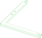
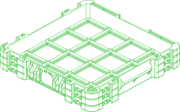

# /pub/storage/workspace/gridfinity

Created by Zach Freedman as a versatile system of modular organization and storage modules.

This package defines the basic building blocks of the Gridfinity system.
Make use of the parameters to customize the parts to your needs.

## Parts

### baseplate
<table><tr>
<td valign=top></td>
<td valign=top>Parameters: <ul>
<li>length_u: 2</li>
<li>width_u: 2</li>
<li>ext_depth: 0.0</li>
<li>straight_bottom: False</li>
<li>corner_screws: False</li>
<li>corner_tab_size: 21.0</li>
<li>csk_hole: 5.0</li>
<li>csk_diam: 10.0</li>
<li>csk_angle: 82.0</li>
</ul>
</td>
</tr></table>

### box
<table><tr>
<td valign=top></td>
<td valign=top>Parameters: <ul>
<li>length_u: 2</li>
<li>width_u: 2</li>
<li>height_u: 2</li>
<li>length_div: 0.0</li>
<li>width_div: 0.0</li>
<li>scoops: False</li>
<li>labels: False</li>
<li>solid: False</li>
<li>holes: False</li>
<li>no_lip: False</li>
<li>solid_ratio: 1.0</li>
<li>lite_style: False</li>
<li>unsupported_holes: False</li>
<li>label_width: 12.0</li>
<li>label_height: 10.0</li>
<li>label_lip_height: 0.8</li>
<li>scoop_rad: 12.0</li>
<li>fillet_interior: True</li>
<li>wall_th: 1.0</li>
</ul>
</td>
</tr></table>

### drawerspacer
<table><tr>
<td valign=top></td>
<td valign=top>Parameters: <ul>
<li>length_u: 2</li>
<li>width_u: 2</li>
<li>length_th: 10.0</li>
<li>width_th: 10.0</li>
<li>thickness: 5.0</li>
<li>chamf_rad: 1.0</li>
<li>show_arrows: True</li>
<li>arrow_h: 0.8</li>
<li>length_fill: 0.0</li>
<li>width_fill: 0.0</li>
<li>align_features: True</li>
<li>align_l: 16.0</li>
<li>align_tol: 0.15</li>
<li>align_min: 8.0</li>
<li>min_margin: 4.0</li>
<li>tolerance: 0.5</li>
</ul>
</td>
</tr></table>

### ruggedbox
<table><tr>
<td valign=top></td>
<td valign=top>Parameters: <ul>
<li>length_u: 4</li>
<li>width_u: 4</li>
<li>height_u: 4</li>
<li>lid_height: 10.0</li>
<li>wall_vgrooves: True</li>
<li>front_handle: True</li>
<li>stackable: True</li>
<li>side_clasps: True</li>
<li>lid_baseplate: True</li>
<li>inside_baseplate: True</li>
<li>side_handles: True</li>
<li>front_label: True</li>
<li>label_length: 0.0</li>
<li>label_height: 0.0</li>
<li>label_th: 0.5</li>
<li>back_feet: True</li>
<li>hinge_width: 48.0</li>
<li>hinge_bolted: False</li>
</ul>
</td>
</tr></table>

  

*Generated by [PartCAD](https://partcad.org/)*
